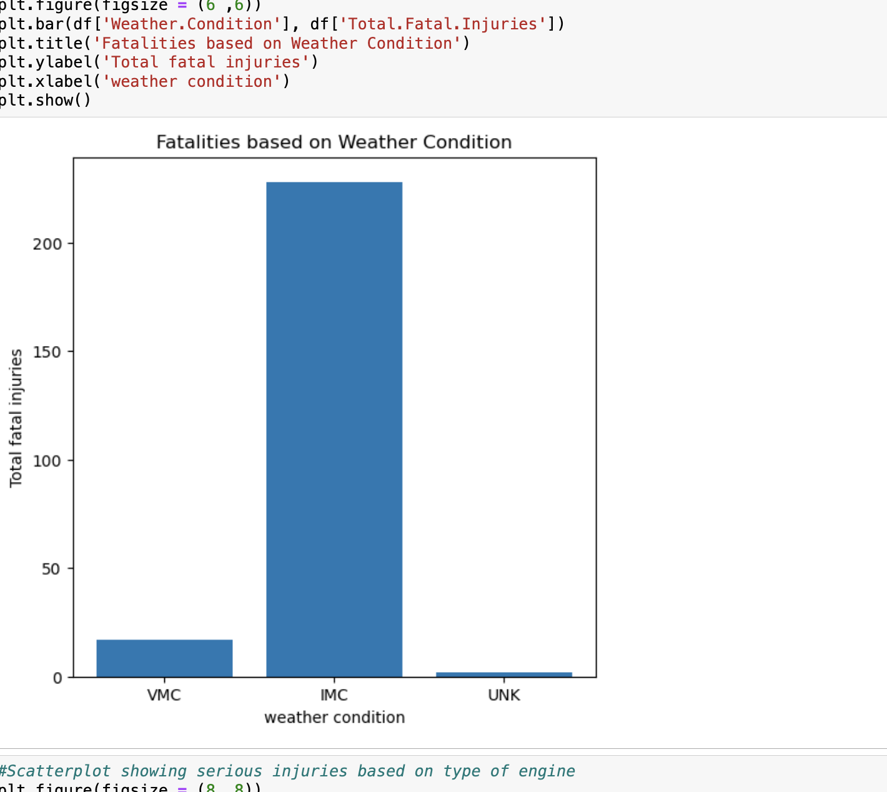

# Overview

For this project, you will use data cleaning, imputation, analysis, and visualization to generate insights for a business stakeholder.

# Busines understanding
The company is new in the industry and they are interested in purchasing and operating airplanes for commercial and private enterprise but they are not familiar with any potential risks.

**Objectives;**
To determine which aircraft are of lowest risk for the company for the company to invest in
Identify main causes of accidents in airlines
Types of airlines that are likely to cause accidents

**Stakeholders**
This are the business investors who are up to start to start the business.The airline manufacturers who can provide suitable aircrafts for desired business and the reliale customers aimed at using the company facilities(aircrafts) and other transport services

**Understanding business concept**
This involves understanding market conditions,competitive environments,regulatory limitations and internal business processes.

**Success criteria**
Ensuring efficiency in operations in terms of time managenent and other terms and condiotions of airline.The company should alse choose the type of aircraft based on their customer need being private or commercial.

**Risks**
Financial crisis
Unskilled personels
Safety incidents

# Data Analysis

## Data Understanding
 This section involves understanding the data that will be used to address the business problem of the company.
Our dataset is obtained from the **The national Transportation Safety Board** that includesaviation accidents data from the year 1962 upto the year 2023 and selected incidents in united states and International waters.
Our data contains 90,348 entries and 31 columns.
 It contains both categorical and continuous data whereby our dtypes are float64(5) and object(26).Some of the information available in our data include:~Categorical Data~ **"Location", "Country" ,"Event.Type ","Engine.Type" , "Model", "Make", "Aircraft.Category","Weather.Condition"** amongst others.~Continuous Data~ **"Number.Engines" , "Total.Fatal.Injuries", "Total.Serious.Injuries", "Total.Minor.Injuries", "Total.Uninjured"**.
  The data has missing values in both of our rows and columns.
  
## Data Cleaning
In this section we are going to indentify which information is best for addressing company issues and drop what is of less or no use for our analysis.

**Steps taken;**

-Exploring individual columns in order to get information of each column
-Checked for duplicated values in general and there were no duplucate values
-Checked the percentage of missing values in each column to identify which columns are best meant for analysis and the ones that have no or less value to our analysis.
Several columns had more than 50 percent of missing values i.e 

Schedule - 86 percent

-FAR.Description - 64 percent

-Longitude - 61 percent

-Latitude - 61 percent

-Air.Carrier - 81 percent

Upon further consideration we decided to drop the columns forn they could make our analysis difficult to to lack of enough data.
We also had the **Airport.Name** and **Airport.Code** columns , since we had the two we decided to drop airport name and retained airport code column since names may be similar but codes are unique.
We also dropped rows with completely missing data in our dataset and performed **df.Describe()** for statistical summary of our continuous data.
Afterwhich we imputed our missing value in contoinous data with median since median has less impact on the distribution.

# Handling of Outliers

Here we handles outliers on our continuous data since it may influence statistical analyses, and impact on decision-making processes.

# Data Grouping and Aggregation

Here we split our data into separate groups and performed computations for better findings.
This data is transformed to actionable information which can help the company gain insights and improve on performance.

# Data Visualization

Visualizations can be accessed in the link below

https://public.tableau.com/app/profile/bosco.mukara/viz/learn-wb-2024-09-JB/Dashboard1?publish=yes

